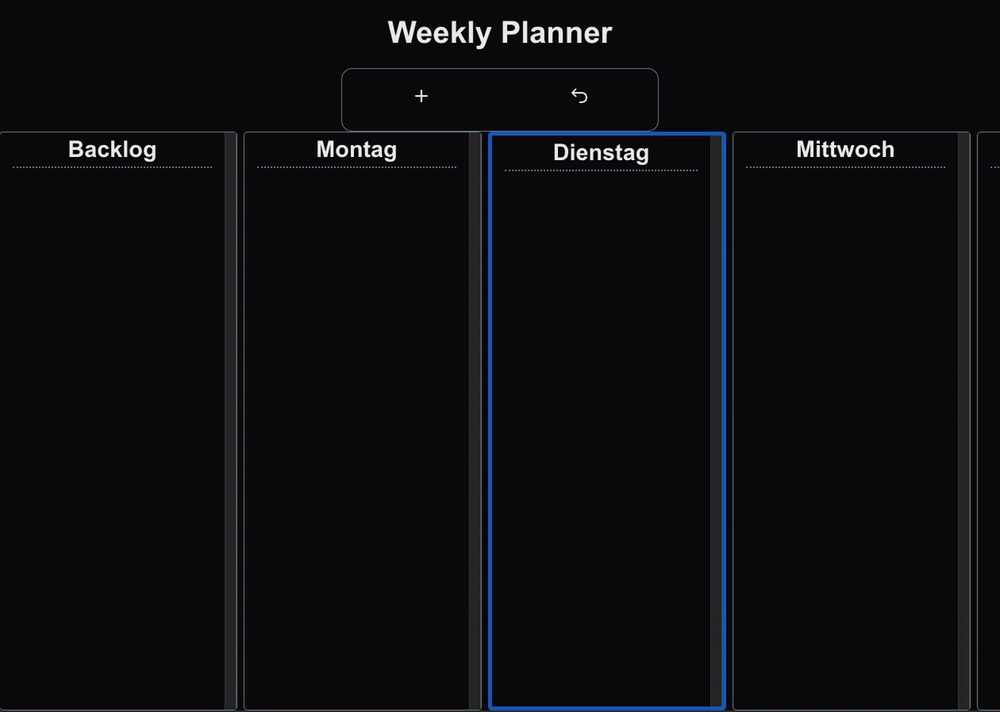

# Weekly Planner

A minimal weekly planning app built with Next.js. Organize your tasks across weekdays, drag them between columns, and track what's done — all persisted in a database.



## Features

- Create todos and assign them to a weekday or the Backlog
- Drag and drop todos between columns (desktop & mobile)
- Mark todos as done, edit or delete them
- Todos are persisted in a MongoDB database via Prisma

## Tech Stack

| Tool                                           | Purpose                        |
| ---------------------------------------------- | ------------------------------ |
| [Next.js 14](https://nextjs.org) (TypeScript)  | Framework, routing, API routes |
| [dnd-kit](https://dndkit.com)                  | Drag-and-drop                  |
| [Prisma](https://prisma.io) + MongoDB          | Database ORM                   |
| [SWR](https://swr.vercel.app)                  | Data fetching & optimistic UI  |
| [Zod](https://zod.dev)                         | Schema validation              |
| [React Hook Form](https://react-hook-form.com) | Form handling                  |

## Getting Started

### Prerequisites

- Node.js 18+
- A MongoDB connection string (e.g. [MongoDB Atlas](https://www.mongodb.com/atlas) free tier)

### Installation

```bash
git clone https://github.com/your-username/weekly-planner.git
cd weekly-planner
npm install
```

Create a `.env` file in the project root:

```env
DATABASE_URL="your-mongodb-connection-string"
```

```bash
npx prisma generate
npm run dev
```

Open [http://localhost:3000](http://localhost:3000) in your browser.

## Testing

```bash
npm test          # run all tests once
npm run test:watch  # watch mode
```

The test suite covers Zod schema validation, form behaviour, and the todo status toggle.

## CI

GitHub Actions runs TypeScript check, ESLint, and the test suite on every push.
